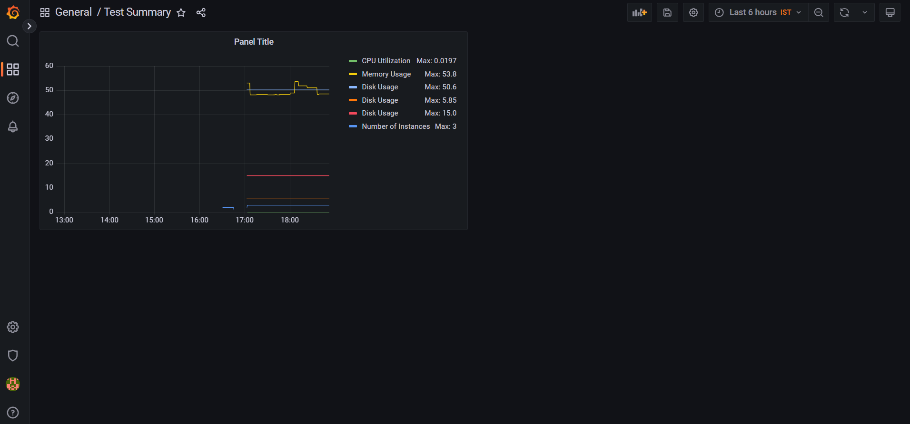
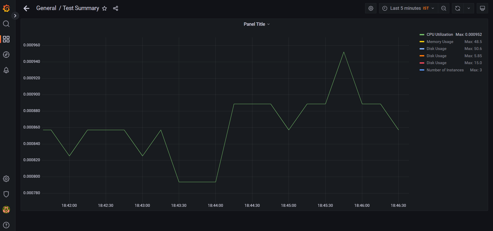

# Detailed Guide: Setting Up Prometheus and Grafana for AWS EC2 Instance Monitoring

This guide provides detailed instructions on setting up Prometheus and Grafana to monitor AWS EC2 instances. It covers installation, configuration, and basic troubleshooting steps.

## Prerequisites

- **AWS Account**: Access to AWS Management Console.
- **EC2 Instances**: Running instances where Node Exporter will be installed.
- **Monitoring Server/Local Linux System**: A server where Prometheus and Grafana will be installed.

### Environment Setup

1. **Create an AWS EC2 Instance**
   - Launch an EC2 instance with an appropriate Amazon Machine Image (AMI) (e.g., Ubuntu, Amazon Linux).

2. **Set Up Security Groups**
   - Configure security groups to allow inbound traffic:
     - Prometheus: TCP port 9090 (Local/Monitoring Server)
     - Grafana: TCP port 3000 (Local/Monitoring Server)
     - Node Exporter: TCP port 9100 (Ec2 Instance You want to Monitor)

3. **Install Required Software on EC2 Instances**
   - **Node Exporter**: Monitoring agent for collecting system metrics.
     ```bash
     # Example for Ubuntu
     wget https://github.com/prometheus/node_exporter/releases/download/v1.2.2/node_exporter-1.2.2.linux-amd64.tar.gz
     tar xvfz node_exporter-1.2.2.linux-amd64.tar.gz
     sudo mv node_exporter-1.2.2.linux-amd64/node_exporter /usr/local/bin/
     sudo useradd --no-create-home --shell /bin/false node_exporter
     sudo chown node_exporter:node_exporter /usr/local/bin/node_exporter
     sudo nano /etc/systemd/system/node_exporter.service
     ```
     Add the following content:
     ```ini
     [Unit]
     Description=Node Exporter
     After=network.target

     [Service]
     User=node_exporter
     Group=node_exporter
     ExecStart=/usr/local/bin/node_exporter

     [Install]
     WantedBy=default.target
     ```
     ```bash
     sudo systemctl daemon-reload
     sudo systemctl start node_exporter
     sudo systemctl enable node_exporter
     ```

4. **Install Prometheus on Monitoring Server**

   - **Download and Install Prometheus**
     ```bash
     wget https://github.com/prometheus/prometheus/releases/download/v2.35.0/prometheus-2.35.0.linux-amd64.tar.gz
     tar xvfz prometheus-2.35.0.linux-amd64.tar.gz
     sudo mv prometheus-2.35.0.linux-amd64/prometheus /usr/local/bin/
     sudo mv prometheus-2.35.0.linux-amd64/promtool /usr/local/bin/
     ```

   - **Configure Prometheus**
     ```bash
     sudo mkdir /etc/prometheus
     sudo nano /etc/prometheus/prometheus.yml
     ```
     Add the following configuration:
     ```yaml
     global:
       scrape_interval: 15s

     scrape_configs:
       - job_name: 'node_exporter'
         ec2_sd_configs:
           - region: ap-south-1
             access_key: YOUR_ACCESS_KEY
             secret_key: YOUR_SECRET_KEY
             port: 9100
         static_configs:
           - targets: ['<EC2_INSTANCE_IP>:9100']
     ```

   - **Start Prometheus**
     ```bash
     prometheus --config.file=/etc/prometheus/prometheus.yml
     ```

5. **Install Grafana on Monitoring Server**

   - **Download and Install Grafana**
     ```bash
     wget https://dl.grafana.com/oss/release/grafana-9.0.0.linux-amd64.tar.gz
     tar -zxvf grafana-9.0.0.linux-amd64.tar.gz
     cd grafana-9.0.0
     ```

   - **Start Grafana Server**
     ```bash
     ./bin/grafana-server &
     ```

6. **Configure Grafana**

   - **Access Grafana Dashboard**
     - Open a web browser and navigate to `http://<MONITORING_SERVER_IP>:3000`.
     - Log in with default credentials (`admin`/`admin`).

   - **Add Prometheus Data Source**
     - Go to Configuration > Data Sources > Add Data Source.
     - Choose Prometheus.
     - Enter URL `http://<PROMETHEUS_SERVER_IP>:9090`.

7. **Create Dashboards and Graphs**

   - **Summary Graph (Single Graph for Multiple Metrics)**
     - Navigate to Create > Dashboard > Add New Panel.
     - Choose Graph.
     - Add queries for CPU, Memory, Disk Usage, and Instance Count.


   - **Individual Graphs (Detailed Metrics)**
     - Create separate panels for:
       - CPU Utilization: `avg(rate(node_cpu_seconds_total{mode!="idle"}[1m])) by (instance)`
       - Memory Usage: `(node_memory_MemTotal_bytes - node_memory_MemAvailable_bytes) / node_memory_MemTotal_bytes * 100`
       - Disk Usage: `node_filesystem_avail_bytes{fstype!="tmpfs"} / node_filesystem_size_bytes{fstype!="tmpfs"} * 100`
       - Number of Instances: `count(up{job="node_exporter"})`



## Troubleshooting

- **Check Prometheus Targets**
  - Open `http://<PROMETHEUS_SERVER_IP>:9090/targets` to verify targets status.
- **Verify Node Exporter Installation**
  - Access `http://<EC2_INSTANCE_IP>:9100/metrics` to ensure metrics are accessible.
- **Restart Services**
  - Restart Prometheus and Grafana services to apply configuration changes.

## Conclusion

This guide provides a detailed walkthrough for beginners to set up Prometheus and Grafana for monitoring AWS EC2 instances. Follow each step carefully to ensure successful setup and effective monitoring of your infrastructure.

## Resources

- [Prometheus Documentation](https://prometheus.io/docs/)
- [Grafana Documentation](https://grafana.com/docs/)
